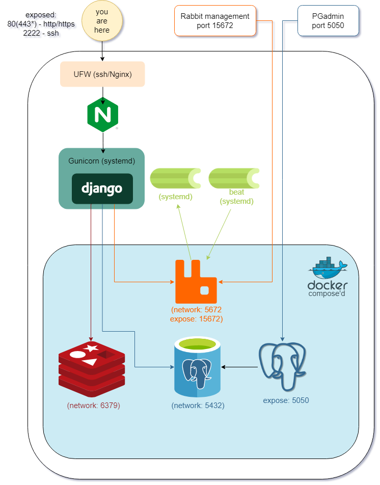

<p id="high-upon-high"></p>
<br/>
<div>
    <a href="https://github.com/github_username/repo_name">
        
    </a>
    <h3 align="center">Django project for geekbrains</h3>
        <p align="center">
            A simple website to practice some django architecture skills on.
        </p>
        <a href="#structure">Structure section</a>
    <br>
</div>

## Technology stack
### python and its infrastructure (as daemons)


### Task managers (as daemons) 


### docker containers (compose'd)


<div align="center">
    <a href="https://github.com/github_username/repo_name">
        
    </a>
</div>

# Project overall description
## Purpose
The main purpose of this course is to take more than <a href="https://gb.ru">Geekbrains</a> can offer, and learn a lot of features such as celery, celery cron, django-rest (by 23.01.23 still not implemented, well done, Pavel) and many more tasty stuff.
This exact project (including huge part of the frontend) was provided by  learning platform as a part of a Pythoing developer course.
You can also find my async client-server application in one of my repos: https://github.com/IUseAll16Letters/gb_client_server.
<br>As a result I've deployed a website on one of <a href="https://selectel.ru/">Selectel</a> VDS'es, god bless them for that!
You can check it on: http://185.137.234.221/, if the hosting is still paid.


# Getting deployed
### It is important to note that there are many env variables required for this project to work (usually stored at .gunicornenv and others .env files).
1. For postgres and django (shell + gunicorn level), including news api key for <a href="https://newsapi.org/">News api I use</a>:
```shell
$ DJANGO_SECRET_KEY, DJANGO_DEBUG, NEWS_API_KEY, POSTGRES_DB, POSTGRES_USER, POSTGRES_PASSWORD
```
And some Ouath stuff (gunicorn level)
```shell
$ SOCIAL_AUTH_GITHUB_KEY, SOCIAL_AUTH_GITHUB_SECRET, SOCIAL_AUTH_VK_OAUTH2_KEY, SOCIAL_AUTH_VK_OAUTH2_SECRET, SOCIAL_AUTH_VK_OAUTH2_API_VERSION
```
2. For PGadmin (shell level):
```shell
$ PGADMIN_DEFAULT_EMAIL, PGADMIN_DEFAULT_PASSWORD, PGADMIN_CONFIG_SERVER_MODE
```
3. For SMTP working correctly (gunicorn level):
```shell
$ EMAIL_HOST, EMAIL_PORT, EMAIL_HOST_USER, EMAIL_HOST_PASSWORD
```
4. For rabbit mq (shell level)
```shell
$ RABBITMQ_SECURE_PASSWORD, RABBITMQ_LOGS, RABBITMQ_DEFAULT_USER, RABBITMQ_DEFAULT_PASS
```

## Now we are trully getting deployd!
1. Clone the repo
    ```shell
   $ git clone git@github.com:IUseAll16Letters/gb_django.git
   ```
2. Install required dependencies
   ```shell
   $ cd gb_django && python3.10 -m venv venv && source venv/bin/activate && pip install -r req.txt
   ```
3. Time to start docker containers!
   ```shell
   $ docker-compose up -d
   ```
4. Apply migrations and load news fixture
   ```shell
   $ python manage.py makemigrations && python manage.py ./mainapp/fixtures/001_news.json
   ```
5. Make messages translation .mo file
   ```shell
   $ django-admin compilemessages
   ```
   Install gettext if required
   ```shell
   $ sudo apt install gettext
   ```
6. Time to release all your daemons! <br>
   Copy systemd configuration files from ./dev to corresponding folders
   .service and .socker files to: ```shell $ /etc/systemd/system```
   braniaclms to /etc/nginx/sites-available, after that create a soft link
   ```shell
   $ sudo ln -s /etc/nginx/sites-available/braniaclms /etc/nginx/sites-enabled/braniaclms 
   ```
### Attention
   The configs are used for user named "django" having sudo permissions. Change for your local user in case of necessary

7. Starting daemons
   ```shell
   $ sudo systemctl enable celeryd.service && sudo systemctl start celeryd.service 
   $ sudo systemctl enable celerybeat.service && sudo systemctl start celerybeat.service
   $ sudo systemctl enable gunicorn.socket && sudo systemctl start gunicorn.socket
   $ sudo systemctl enable gunicorn.service && sudo systemctl start celerybeat.service
   ```
8. If you did everything correct - it means that it's time to congratz both of us with the server deployment!

<div align="right">
   <a href="#high-upon-high">High upon high</a>
</div>